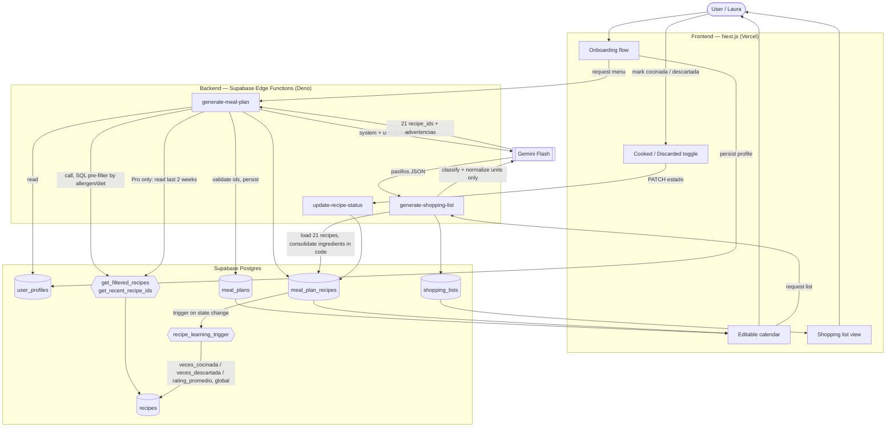
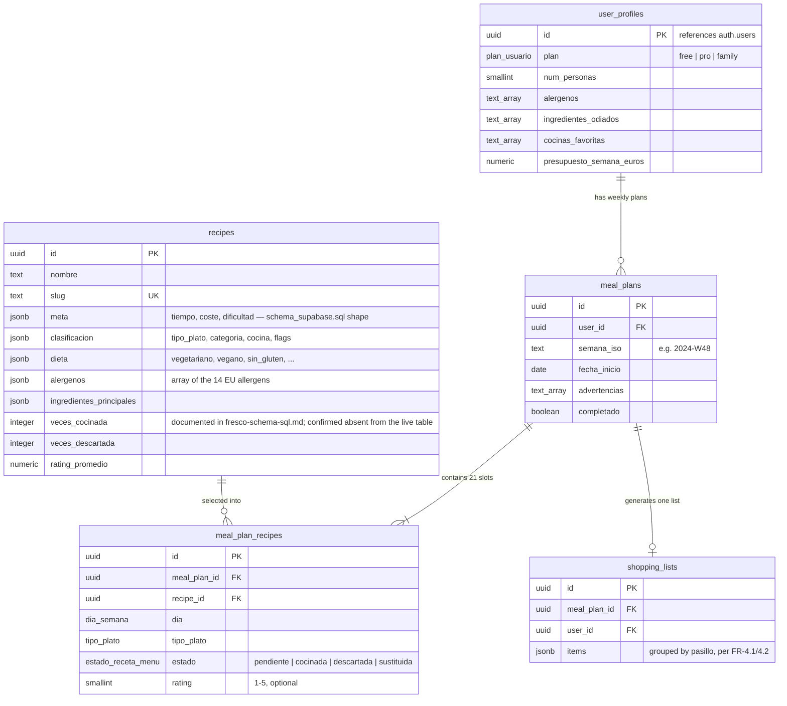

# Architecture — Fresco

> SRS output of `/project-foundation` Phase 3 (Architecture — Software side). Traces to `functional-requirements.md` and `non-functional-requirements.md`. Primary source: the founder's technical brief (`fresco-core-tecnico.md` §6 "Flujo completo", `fresco-edge-function-generate.md`, `fresco-shopping-list.md`, `fresco-aprendizaje.md`) plus `schema_supabase.sql` (the actually-executed schema) and `fresco-schema-sql.md` (the fuller documented design). No SQL migration files are created or modified by this document — per this phase's own scope rule, schema is quoted/summarized here as a **contract**, not authored as runnable migrations (that belongs to `/project-bootstrap`).

## 1. System Architecture

**Reading the diagram**: the cooked/discarded *recording* path (bottom) is universal — every tier writes to `meal_plan_recipes` and fires the same trigger. The *learning application* is what forks by tier: only when `GenMenu` builds next week's prompt does the `isPro` flag decide whether `get_recent_recipe_ids()` output is included at all (FR-5.4). Free-tier generation always takes the top path (Profiles → FilterFn → Gemini) with an empty history section.

## 2. Tech Stack Justification

| Component | Why chosen | Trade-off |
|---|---|---|
| **Frontend: Next.js** | Founder's existing choice (`.agents/project.yaml`); no source document explains the reasoning beyond it being the assumed stack. | ❌ Because the actual backend logic lives in Supabase Edge Functions rather than Next.js API routes, this is a **split backend topology**: two runtimes (see below), not the more common "Next.js does everything" full-stack pattern. Worth naming explicitly so it isn't assumed away during scaffolding. |
| **Hosting: Vercel** | Native pairing with Next.js; matches `.agents/project.yaml` environments (`local`, `staging`, both pointing at `fresco-pro.vercel.app`). | ❌ No `production` environment block is yet defined in `.agents/project.yaml` — only `local` and `staging` exist (`[PLACEHOLDER]`, flagged for `/project-bootstrap` or a later env-setup pass). |
| **Backend: Supabase (Postgres + Auth + Edge Functions + RLS)** | One integrated platform covering database, auth, serverless functions, and row-level security — matches the founder-time constraint named explicitly in `business-model.md` (Key Resources: "Founder time and attention, currently the primary constraint"). A single vendor for data + auth + compute minimizes the ops surface a solo founder has to run. | ❌ Edge Functions execute on **Deno**, a different runtime from the Next.js app's Node/Vercel environment — two module systems and standard libraries to keep straight (see NFR-MAINT-1). ❌ RLS correctness becomes a single point of security failure across every user table (see NFR-SEC-2's flagged `recipes` policy discrepancy). |
| **AI model: Gemini Flash** | Explicit founder choice, reasoned directly in the source docs: `responseMimeType: 'application/json'` forces native JSON output, which the founder notes "rara vez devuelve JSON malformado" — directly reducing the retry/parse-failure surface the 30-second budget (NFR-PERF-1) depends on. Cost/speed profile fits the sub-30-second generation target. | ❌ Real vendor lock-in to Google's Generative Language API; the source code pins a specific model string (`gemini-1.5-flash`), which is itself a versioning risk if Google deprecates or silently changes that model's behavior. ❌ `temperature: 0.7` for menu generation is a tuned trade-off (enough variety week-to-week without losing filter coherence) that would need re-validation against any model swap. |
| **Postgres extensions:** `uuid-ossp` / `gen_random_uuid()`, `pg_trgm` | UUID primary keys throughout; `pg_trgm` enables fuzzy `ILIKE`/typo-tolerant search on `recipes.nombre` (`schema_supabase.sql` §5). | ❌ None material at this scale — standard Postgres extensions, no lock-in beyond Postgres itself. |

## 3. Data Flow

### 3.1 Menu generation (the core promise)

1. User completes onboarding or requests a regeneration (Frontend).
2. `generate-meal-plan` Edge Function authenticates the caller via `Authorization` header → `supabase.auth.getUser()` (`401` if missing/invalid).
3. Loads the caller's `user_profiles` row.
4. Checks a plan doesn't already exist for the requested `semana_iso` (`409` if it does — no silent overwrite).
5. Calls `get_filtered_recipes(user_id)` — a SQL pre-filter that excludes any recipe conflicting with declared allergens, active diet flags, or disliked ingredients (cheap, structural safety layer — FR-8.1 Layer 1). Errors if fewer than 21 recipes remain (`422`, "Catálogo insuficiente").
6. **Pro tier only:** calls `get_recent_recipe_ids(user_id, weeks=2)` to fetch the last-2-weeks cooked/discarded history.
7. Builds the system prompt (fixed) and user prompt (profile + filtered catalog + history section, dynamically built) and calls Gemini Flash.
8. Parses and validates the response (recipe IDs exist, no lunch/dinner repeats, breakfast ≤ 3 repeats, `semana` matches); retries up to 2 times on failure.
9. Persists a `meal_plans` row, then 21 `meal_plan_recipes` rows (one manual compensating delete of the `meal_plans` row if the second insert fails — see NFR-REL-2).
10. Returns an enriched response (full recipe objects per slot, not just IDs) to the frontend, which renders the calendar.

### 3.2 Cooked/discarded feedback loop

1. User taps ✓ Cocinada / ✗ Descartar / ↔ Cambiar on a calendar slot (Frontend).
2. `update-recipe-status` Edge Function authenticates, verifies the slot belongs to the caller (join through `meal_plans.user_id`), and rejects if the slot is already terminal (`cocinada`/`descartada`).
3. Updates `meal_plan_recipes.estado` (and `rating` if present).
4. A Postgres trigger (`recipe_learning_trigger`) fires on the state change and updates the recipe's global `veces_cocinada` / `veces_descartada` / `rating_promedio` — this happens for every tier, unconditionally (FR-5.1, FR-5.3).
5. Next time this user (if Pro) requests a menu, step 3.1.6 reads this history back in.

### 3.3 Shopping list generation (separate, on-demand)

1. User requests the shopping list for an existing `meal_plan_id` (typically right after generation, or on first tap of "Ver lista de la compra").
2. `generate-shopping-list` verifies the plan belongs to the caller and that no list already exists for it (`409` otherwise).
3. Loads all 21 slots' recipes and their `ingredientes_principales`.
4. **Consolidates in application code** — not in the model: deduplicates ingredient names, sums quantities scaled by household size using a base-quantity lookup table, unifies compatible units (e.g. `g`↔`kg`).
5. Sends the already-consolidated list to Gemini Flash (`temperature: 0.2` — classification, not creative generation) to assign aisles and normalize display units.
6. Validates that ≥ 90% of the consolidated ingredient count survived classification; retries up to 2 times otherwise.
7. Persists to `shopping_lists.items` (jsonb) and returns the aisle-grouped list to the frontend.

## 4. Data Model

**A note on source authority for this section**: two founder documents described the schema, and were not identical. `schema_supabase.sql` (a **JSONB-flexible** shape — `meta`, `clasificacion`, `dieta`, `alergenos`, `ingredientes_principales`, `ingredientes_que_puede_desagradar`, `temporada`, `pasos_resumen` all stored as `jsonb` columns rather than typed relational columns, read/filtered via GIN indexes, `anon` read access) vs. `fresco-schema-sql.md` (a fuller, six-table, **strongly-typed relational** design with enum types and individual boolean/enum columns instead of jsonb blobs).

**Confirmed by the founder (2026-07-25): `schema_supabase.sql`'s JSONB `recipes` shape is live** — it has been executed against the project's Supabase instance and already holds ~35 seeded recipes. It is authoritative for `recipes`, not a candidate under reconciliation. The remaining four tables (`user_profiles`, `meal_plans`, `meal_plan_recipes`, `shopping_lists`) are **confirmed not yet created** — they exist only as the `fresco-schema-sql.md` design and still need to be migrated in, following whichever column shape (typed vs. jsonb) `/project-bootstrap` decides for consistency with the live `recipes` table. The `aprendizaje` learning columns (`veces_cocinada`, `veces_descartada`, `rating_promedio`, `ultima_vez_en_menu` — the ADR-0001 moat) are **confirmed absent from the live `recipes` table** — this is a required schema migration before the Pro-tier learning loop (§3.2, ADR-0001) can function, not an oversight in this document. `/project-bootstrap` owns writing that migration; this SRS records the requirement.

**Learning fields, specifically** (the ADR-0001 moat): the `aprendizaje` sub-object in `fresco-core-tecnico.md`'s conceptual recipe schema (`veces_cocinada`, `veces_descartada`, `rating_promedio`, `ultima_vez_en_menu`) is realized as flat top-level columns on `recipes` in `fresco-schema-sql.md`'s typed design, updated by `recipe_learning_trigger`. The live `recipes` table (confirmed executed, ~35 recipes seeded) does **not yet contain these columns** — adding them is a required migration, not an oversight in this document.

**Aggregation model**: `veces_cocinada`/`veces_descartada`/`rating_promedio` are intentionally **global across all users**, not per-user, in the MVP — a stated, deliberate trade-off (`fresco-schema-sql.md`: "más robustas que las individuales" with a small user base) with an explicit deferred-debt marker for a future `user_recipe_stats` table once volume justifies fully personalized aggregation ("Fase 2" in the source doc).

## 5. Security Architecture

**Auth flow**: Supabase Auth issues a JWT on signup/login; the frontend attaches it as a Bearer token; every Edge Function verifies it via `supabase.auth.getUser()` before touching any data (NFR-SEC-1). Guest mode (EPIC-FRESCO-6) does not yet have a defined auth flow in any source document — flagged, not invented (see FR-6.1).

**RBAC**: not role-based in the traditional sense — authorization is row-ownership-based (RLS keyed to `auth.uid()`), plus a `service_role` vs `authenticated` split for the one genuinely privileged operation (writing to the shared `recipes` catalog during the batch-generation pipeline). There is no `admin`/`user` role distinction anywhere in the source material.

**Data protection**: HTTPS/TLS inherited from Vercel + Supabase platform defaults; `GEMINI_API_KEY` isolated to the Edge Function secret store (NFR-SEC-3); input validation performed server-side in each Edge Function before any DB or LLM call.

**The two-layer food-safety invariant** (FR-8.1) is the one architectural decision in this document promoted to a standalone ADR — see ADR-0001, which frames not just the safety mechanism but the deeper structural bet it sits inside: the behavioral-learning data model this same allergen/hated-ingredient filtering pipeline feeds is the product's core moat.

## 6. Deployment Topology

Per `.agents/project.yaml`:

| Environment | Web URL | API | Supabase project |
|---|---|---|---|
| `local` | `http://localhost:3000` | `http://localhost:3000/api` | `czuusjchqpgvanvbdrnz` |
| `staging` (default active env) | `fresco-pro.vercel.app` | `fresco-pro.vercel.app/api` | `czuusjchqpgvanvbdrnz` |
| `production` | `[PLACEHOLDER]` — not yet defined in `.agents/project.yaml` | — | — |

`local` and `staging` currently point at the **same** Supabase project ref — there is no environment-level database isolation yet configured. Whether that is intentional for the current pre-launch/concierge stage (one small dataset, one founder) or a gap to close before real user data accumulates is a decision for `/project-bootstrap`, not resolved here. Git strategy is `solo-main` (`.agents/project.yaml` — `git_strategy`): a single long-lived `main` branch, direct push, no integration branch — consistent with a solo-founder MVP that has not yet needed a promotion pipeline.

Supabase Edge Functions deploy independently of the Vercel frontend build (`supabase functions deploy`), meaning a frontend deploy and a backend (Edge Function) deploy are two separate release events, not one atomic unit — worth naming for whoever writes the eventual CI/CD pipeline in `/project-bootstrap`.

## 7. ADRs seeded from this phase

- **ADR-0001 — Behavioral-learning moat as the pricing-tier boundary** (`.context/ADR/ADR-0001-behavioral-learning-moat.md`, Status: Proposed). Covers the decision to encode the product's defensibility directly in the `recipes.aprendizaje` schema shape and gate its *application* (not its *recording*) behind the Free/Pro boundary — the single hardest-to-reverse bet in this architecture, since reversing it later means both a schema migration and a pricing-page rewrite.
